# RICOH THETA Plug-in Library

Copied from the 
[RICOH THETA Plug-in SDK](https://github.com/ricohapi/theta-plugin-sdk) with no
modifications to the library. 
Intended for developers that want to create a new Android
SDK and import the module.

The plug-in library implements the following functions:

    * Get button operation event
    * Plug-in termination processing
    * LED control
    * Control of speaker

By inheriting `PluginActivity` you will be able to use library methods.

        ```java
        public class MainActivity extends PluginActivity {
            @Override
            protected void onCreate (Bundle savedInstanceState) {
                super.onCreate (savedInstanceState);
                setContentView (R.layout.activity_main);
        ```

Please refer to the [Plug-in Development Guide](http://theta360.guide/plugin/) 
for usage information.

1. Import "pluginlibrary" in the SDK by selecting "File"-"New"-"Import Module..."
2. Add "include ':app', ':pluginlibrary'" in "settings.gradle" file
3. You may need to add `implementation project(':pluginlibrary')` in build.gradle
4. Sync by selecting "File"-"Sync Project with Gradle Files"

## Start New Project

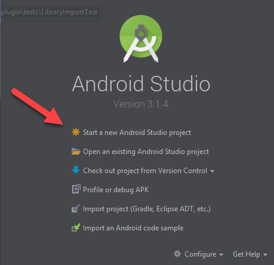 

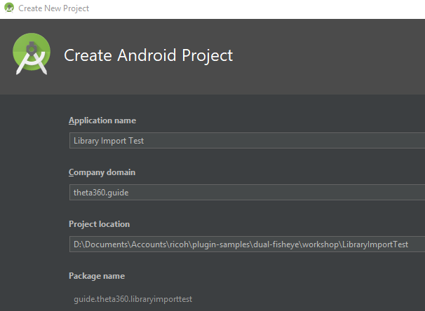 

## Select API 25

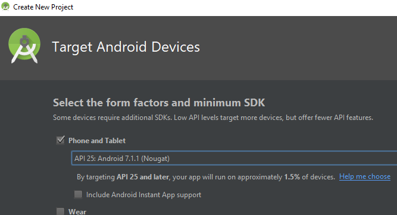 

## Basic Activity

I'm using Basic Activity. You can use any template and work from there.

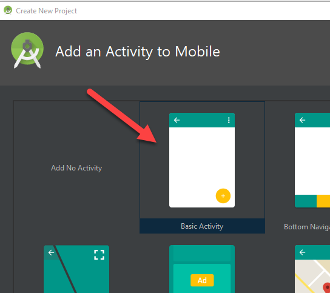 

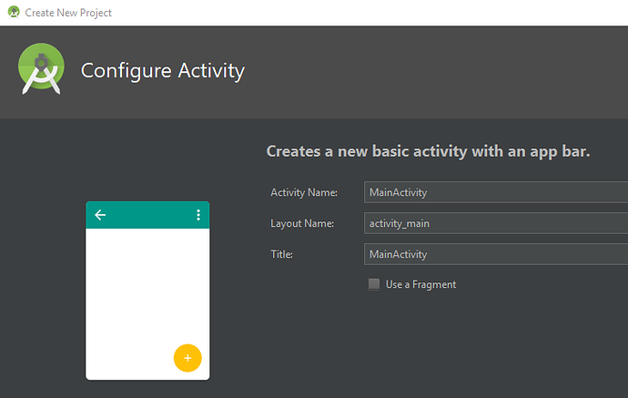 

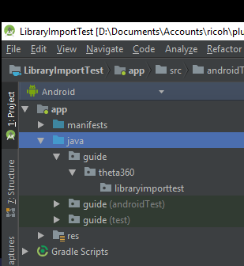 

## Import module

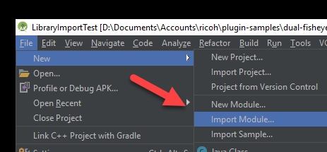 

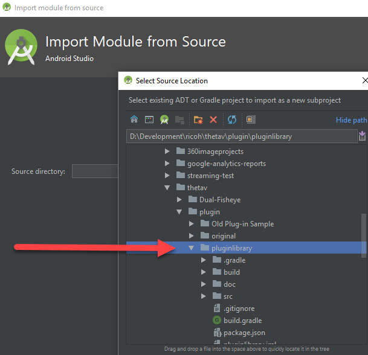 

## Edit Gradle Configuration Files

In build.gradle

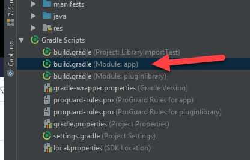 

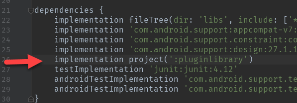 

In settings.gradle

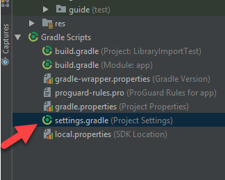 

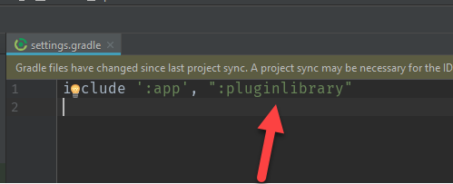 

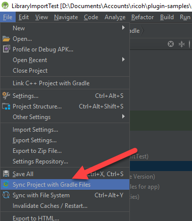 

## import pluginlibrary into MainActivity.java

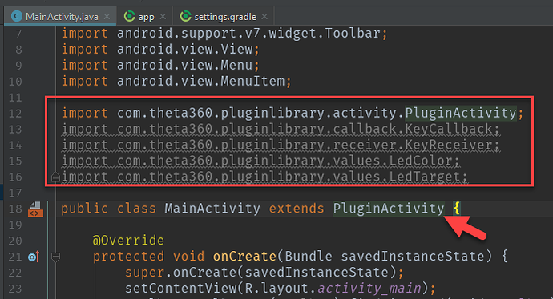 

## Build apk

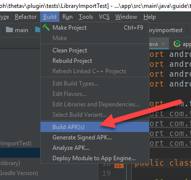 

Success.

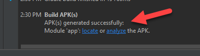 


## Test in Camera

To verify that your application is controlling the camera, write a simple test will light up two LEDs on the camera when it is placed into plug-in mode.

### Code Listing of Import Test

    package guide.theta360.libraryimporttest;

    import android.os.Bundle;
    import android.view.KeyEvent;

    import com.theta360.pluginlibrary.activity.PluginActivity;
    import com.theta360.pluginlibrary.callback.KeyCallback;
    import com.theta360.pluginlibrary.receiver.KeyReceiver;
    import com.theta360.pluginlibrary.values.LedColor;
    import com.theta360.pluginlibrary.values.LedTarget;

    public class MainActivity extends PluginActivity {

        @Override
        protected void onCreate(Bundle savedInstanceState) {
            super.onCreate(savedInstanceState);
            setContentView(R.layout.activity_main);

            setKeyCallback(new KeyCallback() {
                @Override
                public void onKeyDown(int keyCode, KeyEvent event) {
                    if (keyCode == KeyReceiver.KEYCODE_CAMERA) {
                        System.out.println("theta debug: pressed camera mode button down");
                    }
                }

                @Override
                public void onKeyUp(int keyCode, KeyEvent event) {
                    notificationLedShow(LedTarget.LED6);
                    notificationLed3Show(LedColor.MAGENTA);
                    System.out.println("theta debug: camera now in plug-in mode  :-)");
                }

                @Override
                public void onKeyLongPress(int keyCode, KeyEvent event) {

                }
            });
        }
    }

### Install apk into camera

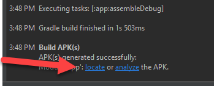 

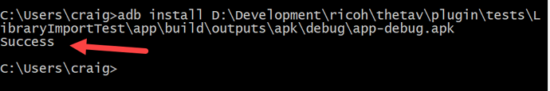 

### Set Library Import Test as Active Plug-in

Use the THETA Desktop application.

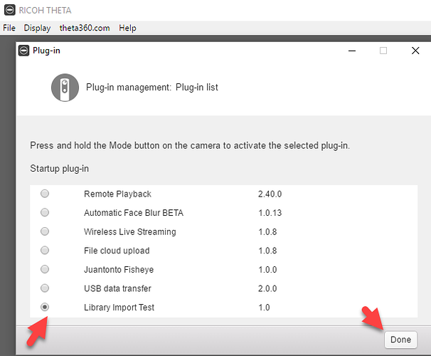 


### Test Plug-in On Camera

Reboot camera. Press mode button for two seconds.

Verify that app is lighting the correct LEDs with the correct color.

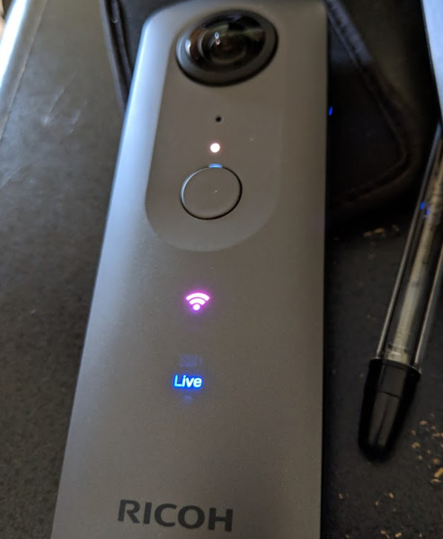 


